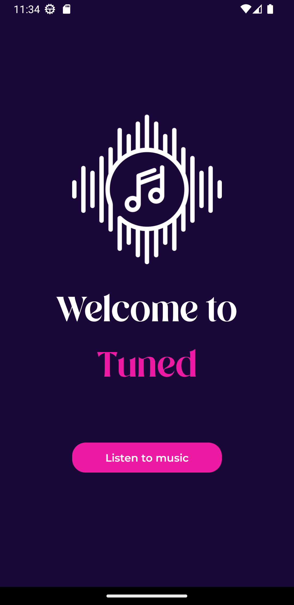
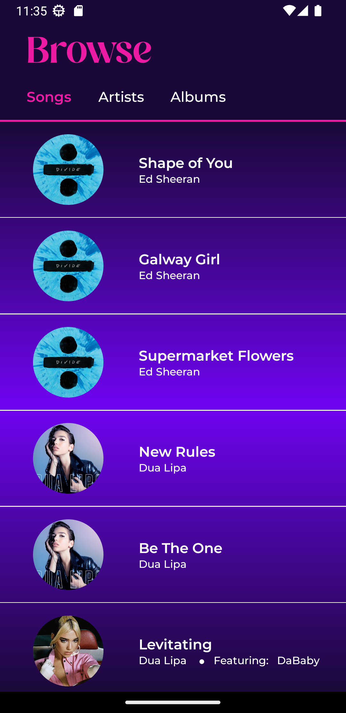
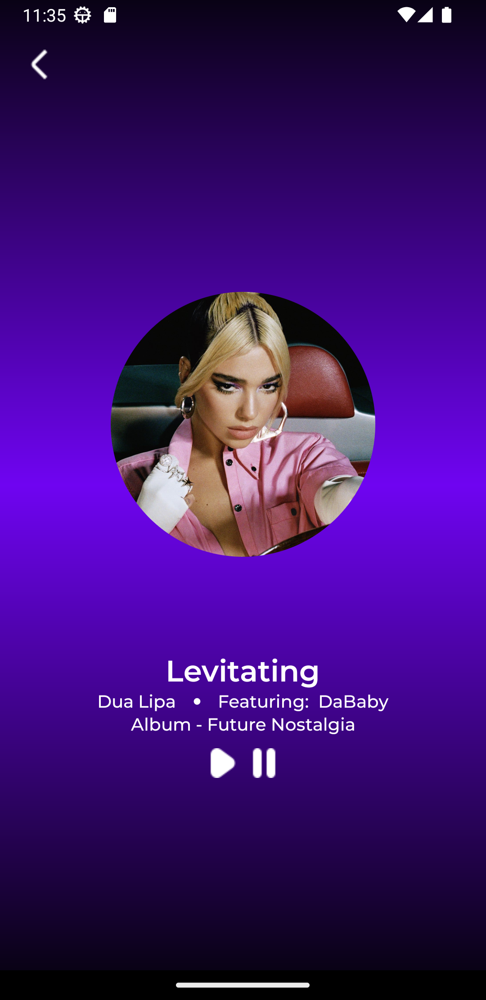
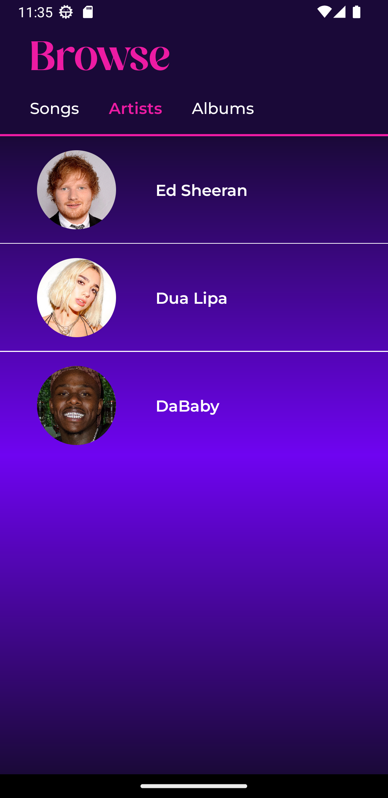
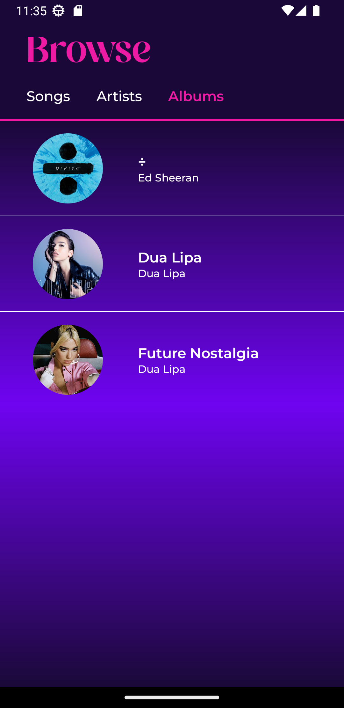

# Tuned

---
## Description

A distinct React Native music player app that allows you to play various songs.

Discover new music and gain deeper insights into your favorite musicians with this all-in-one music player app.

### Songs Screen
Here, you can look through all the songs available and choose which one you want to listen to.

### Player
Here, you can play the song and pause it.

### Artists Screen
Here, you can see all the artists whose songs are available and learn valuable information about them.

### Albums Screen
Here, you can see all the albums with its list of songs available. 

  
  

---

<a href="https://www.flaticon.com/free-icons/music" title="music icons">Music icons created by Freepik - Flaticon</a>